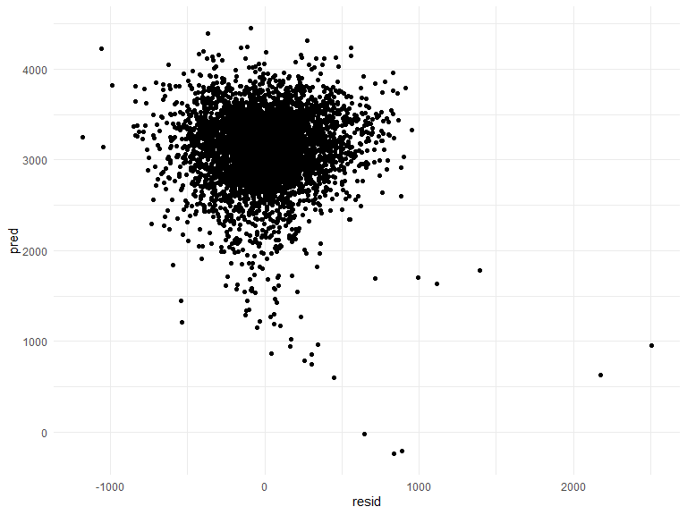

p8105\_hw06\_nj2208
================
James Ng
11/23/2019

## Problem 1

``` r
birthweight = read_csv("./data/birthweight.csv")
```

    ## Parsed with column specification:
    ## cols(
    ##   .default = col_double()
    ## )

    ## See spec(...) for full column specifications.

``` r
bw_mod = birthweight %>% 
  mutate(
    babysex = case_when(
      babysex == 1 ~"male",
      babysex == 2 ~"female"),
    frace = case_when(
      frace == 1 ~"white",
      frace == 2 ~"black",
      frace == 3 ~"asian",
      frace == 4 ~"puerto_rican",
      frace == 8 ~"other",
      frace == 9 ~"unknown"),
    mrace = case_when(
      mrace == 1 ~"white",
      mrace == 2 ~"black",
      mrace == 3 ~"asian",
      mrace == 4 ~"puerto_rican",
      mrace == 8 ~"other"),
    malform = case_when(
      malform == 0 ~"absent",
      malform == 1 ~"present")
    )
```

``` r
bw_guess1 = lm (bwt ~ ., data=bw_mod)%>% 
  broom::tidy()

bw_guess2 = lm (
  bwt ~ babysex + bhead + blength + delwt +gaweeks + parity + smoken, 
  data=bw_mod)
```

``` r
guess = bw_mod %>% 
  modelr::add_residuals(bw_guess2) %>%  
  modelr::add_predictions(bw_guess2)
guess %>% 
ggplot(aes(x=resid,y=pred))+
  geom_point()
```



I first fitted a linear model using all the possible predictors and then
did a shortened version of backward elimination just to get a prelim
model to work with.

``` r
model_1 = lm(bwt ~ blength + gaweeks, data = bw_mod)
model_2 = lm(bwt ~ bhead*blength*babysex, data = bw_mod)
```

## Problem 2

``` r
weather_df = 
  rnoaa::meteo_pull_monitors(
    c("USW00094728"),
    var = c("PRCP", "TMIN", "TMAX"), 
    date_min = "2017-01-01",
    date_max = "2017-12-31") %>%
  mutate(
    name = recode(id, USW00094728 = "CentralPark_NY"),
    tmin = tmin / 10,
    tmax = tmax / 10) %>%
  select(name, id, everything())
```

    ## Registered S3 method overwritten by 'hoardr':
    ##   method           from
    ##   print.cache_info httr

    ## file path:          C:\Users\CIIEQU~1\AppData\Local\rnoaa\rnoaa\Cache/ghcnd/USW00094728.dly

    ## file last updated:  2019-11-24 20:13:47

    ## file min/max dates: 1869-01-01 / 2019-11-30
